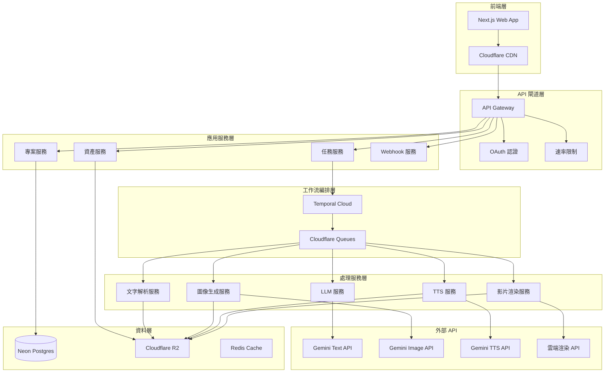
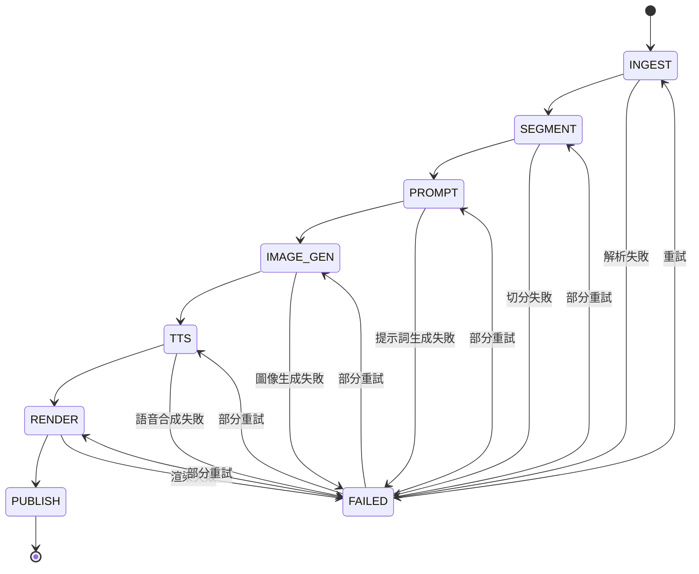

# Epic Auto Video Machine - 設計文檔

## 概述

Epic Auto Video Machine 採用雲端原生的微服務架構，基於 API 編排模式構建。系統以 Gemini API 為核心，整合文字處理、圖像生成、TTS 和影片渲染服務，提供端到端的自動化影片生成能力。

### 核心設計原則

1. **雲端優先**：完全基於雲端服務，無需本地安裝
2. **API 編排**：使用工作流引擎協調多個 API 服務
3. **Gemini-first**：優先使用 Google Gemini 系列 API（Text、Image、TTS）
4. **預設即好用**：提供開箱即用的體驗，進階設定收納在設定中
5. **多比例支援**：原生支援 9:16/16:9/1:1 三種影片比例
6. **彈性擴展**：支援高併發和動態擴容
7. **成本透明**：即時成本追蹤和預算控制（±20% 誤差範圍）
8. **高級感 UI**：漸層設計、玻璃擬態、流暢動效

### 技術棧選擇

**前端：** Next.js 14 + TypeScript + Tailwind CSS + Framer Motion
**後端：** Next.js API Routes + Prisma ORM + Neon Postgres  
**工作流：** Temporal Cloud 或 Cloudflare Queues
**儲存：** Cloudflare R2 + CDN
**部署：** Vercel 或 Cloudflare Pages
**監控：** OpenTelemetry + APM
**認證：** NextAuth.js + OAuth 2.0

## 架構

### 系統架構圖



### 工作流狀態機



## 元件和介面

### 前端元件架構

```typescript
// 核心元件結構
interface ComponentArchitecture {
  pages: {
    HomePage: '儀表板和專案列表（漸層背景、玻璃擬態卡片）'
    ProjectWizard: '新專案建立向導（單頁流程）'
    TaskDetail: '任務詳情和 DAG 進度追蹤'
    Settings: '用戶設定和偏好（分類收納）'
  }

  components: {
    UploadZone: '拖拽上傳區域（大圓角、動效回饋）'
    SceneEditor: '場景編輯器（可視化切分、合併拆分）'
    TemplateSelector: '模板選擇器（三種風格預覽）'
    AspectRatioSelector: '比例選擇器（9:16/16:9/1:1 + 安全框）'
    ProgressTracker: 'DAG 進度追蹤器（即時狀態更新）'
    CostEstimator: '成本估算器（±20% 區間顯示）'
    VoiceSelector: '語音選擇器（男/女/自然聲）'
    ShareModal: '分享模態框（簽名 URL + 公共頁面）'
  }

  hooks: {
    useProject: '專案狀態管理'
    useJob: '任務狀態管理（WebSocket 即時更新）'
    useAuth: 'OAuth 認證管理'
    useCost: '成本追蹤和預算控制'
    useSettings: '用戶偏好和 BYO 金鑰管理'
  }

  design_tokens: {
    colors: {
      primary_gradient: '#7C3AED → #06B6D4'
      secondary_gradient: '#1E293B → #0EA5E9'
      glass_overlay: 'rgba(255,255,255,0.1)'
    }
    typography: {
      font_family: 'Inter, Noto Sans TC'
      heading_weight: 700
      body_weight: '400-500'
    }
    spacing: {
      border_radius: '24px'
      card_shadow: 'elevation-2'
      transition_duration: '300ms'
    }
  }
}
```

### API 介面設計

#### 專案管理 API

```typescript
// POST /v1/projects
interface CreateProjectRequest {
  title: string
  description?: string
  config: ProjectConfig
}

interface CreateProjectResponse {
  id: string
  title: string
  status: 'draft' | 'ready' | 'processing' | 'completed' | 'failed'
  created_at: string
  config: ProjectConfig
}

// POST /v1/projects/{id}/upload
interface UploadRequest {
  file: File | string // 檔案或純文字
  options: {
    auto_segment: boolean
    use_llm_segment: boolean
  }
}

interface UploadResponse {
  project_id: string
  parsed_content: {
    text: string
    word_count: number
    estimated_scenes: number
  }
  scenes: Scene[]
}
```

#### 任務執行 API

```typescript
// POST /v1/projects/{id}/run
interface RunJobRequest {
  config: {
    aspect_ratio: '9:16' | '16:9' | '1:1'
    template: 'classic' | 'dark' | 'vivid'
    voice: 'male' | 'female' | 'natural'
    images_per_scene: 1 | 2 | 3
    transitions: 'none' | 'fade' | 'zoom'
  }
  scenes: Scene[]
}

interface RunJobResponse {
  job_id: string
  estimated_cost: CostEstimate
  estimated_duration: number // 秒
  status: 'queued'
}

// GET /v1/jobs/{id}
interface JobStatusResponse {
  id: string
  project_id: string
  status: JobStatus
  progress: JobProgress
  cost: {
    estimated: CostEstimate
    actual: CostActual
  }
  assets: Asset[]
  error?: ErrorDetail
}
```

### 資料模型

#### 核心實體

```sql
-- 專案表
CREATE TABLE projects (
    id UUID PRIMARY KEY DEFAULT gen_random_uuid(),
    user_id UUID NOT NULL REFERENCES users(id),
    title VARCHAR(255) NOT NULL,
    description TEXT,
    status project_status NOT NULL DEFAULT 'draft',
    config JSONB NOT NULL,
    created_at TIMESTAMP WITH TIME ZONE DEFAULT NOW(),
    updated_at TIMESTAMP WITH TIME ZONE DEFAULT NOW()
);

-- 任務表
CREATE TABLE jobs (
    id UUID PRIMARY KEY DEFAULT gen_random_uuid(),
    project_id UUID NOT NULL REFERENCES projects(id),
    status job_status NOT NULL DEFAULT 'queued',
    config JSONB NOT NULL,
    cost_estimate JSONB,
    cost_actual JSONB,
    started_at TIMESTAMP WITH TIME ZONE,
    finished_at TIMESTAMP WITH TIME ZONE,
    error_detail JSONB,
    created_at TIMESTAMP WITH TIME ZONE DEFAULT NOW()
);

-- 場景表
CREATE TABLE scenes (
    id UUID PRIMARY KEY DEFAULT gen_random_uuid(),
    project_id UUID NOT NULL REFERENCES projects(id),
    index INTEGER NOT NULL,
    text TEXT NOT NULL,
    prompt TEXT,
    image_asset_id UUID REFERENCES assets(id),
    created_at TIMESTAMP WITH TIME ZONE DEFAULT NOW()
);

-- 資產表
CREATE TABLE assets (
    id UUID PRIMARY KEY DEFAULT gen_random_uuid(),
    user_id UUID NOT NULL REFERENCES users(id),
    type asset_type NOT NULL,
    uri TEXT NOT NULL,
    metadata JSONB,
    size_bytes BIGINT,
    created_at TIMESTAMP WITH TIME ZONE DEFAULT NOW(),
    expires_at TIMESTAMP WITH TIME ZONE
);

-- 預設模板表
CREATE TABLE presets (
    id UUID PRIMARY KEY DEFAULT gen_random_uuid(),
    user_id UUID NOT NULL REFERENCES users(id),
    name VARCHAR(255) NOT NULL,
    config JSONB NOT NULL,
    is_default BOOLEAN DEFAULT FALSE,
    created_at TIMESTAMP WITH TIME ZONE DEFAULT NOW()
);
```

#### 列舉類型

```sql
CREATE TYPE project_status AS ENUM ('draft', 'ready', 'processing', 'completed', 'failed');
CREATE TYPE job_status AS ENUM ('queued', 'running', 'succeeded', 'failed', 'cancelled');
CREATE TYPE asset_type AS ENUM ('image', 'audio', 'video', 'text', 'json');
```

## 資料模型

### 配置結構

```typescript
interface ProjectConfig {
  aspect_ratio: '9:16' | '16:9' | '1:1' // 預設 9:16
  template: TemplateConfig
  voice: VoiceConfig
  generation: GenerationConfig
  safety: SafetyConfig
}

interface TemplateConfig {
  name: 'classic' | 'dark' | 'vivid' // 預設 classic
  style: {
    classic: '白底細陰影 + 輕轉場'
    dark: '深色玻璃擬態風格'
    vivid: '鮮豔漸層背景'
  }
  transitions: 'none' | 'fade' | 'zoom' // 預設 fade
  transition_duration: 500 // 毫秒，預設 500ms
  background_music: boolean // 預設 true
  bgm_volume: -18 // LUFS，預設 -18
}

interface VoiceConfig {
  type: 'male' | 'female' | 'natural' // 預設 natural
  speed: 1.0 // 0.9-1.1，預設 1.0
  language: 'zh-TW' | 'en' // 預設 zh-TW
  accent: 'taiwan' | 'mainland' | 'hongkong' // 預設 taiwan
}

interface GenerationConfig {
  images_per_scene: 1 | 2 | 3 // 預設 1（快速），可選 3（較美觀）
  image_quality: 'standard' | 'high' // 預設 standard
  retry_attempts: 3 // 預設最多重試 3 次
  timeout_seconds: 300 // 預設 5 分鐘超時
  smart_crop: boolean // 預設 true，智慧裁切適應比例
}

interface SafetyConfig {
  content_policy: 'strict' | 'standard' // 預設 standard
  blocked_words: string[] // 自訂禁用詞庫
  error_strategy: 'skip' | 'mask' | 'fail' // 預設 skip
  adult_content: 'block' | 'warn' | 'allow' // 預設 block
  violence_filter: boolean // 預設 true
}

// 解析度對應表
interface ResolutionMapping {
  '9:16': { width: 1080; height: 1920; name: '直式短片' }
  '16:9': { width: 1920; height: 1080; name: '橫式影片' }
  '1:1': { width: 1080; height: 1080; name: '方形貼文' }
}

// 預設值常數
const DEFAULT_CONFIG: ProjectConfig = {
  aspect_ratio: '9:16',
  template: {
    name: 'classic',
    transitions: 'fade',
    transition_duration: 500,
    background_music: true,
    bgm_volume: -18,
  },
  voice: {
    type: 'natural',
    speed: 1.0,
    language: 'zh-TW',
    accent: 'taiwan',
  },
  generation: {
    images_per_scene: 1,
    image_quality: 'standard',
    retry_attempts: 3,
    timeout_seconds: 300,
    smart_crop: true,
  },
  safety: {
    content_policy: 'standard',
    blocked_words: [],
    error_strategy: 'skip',
    adult_content: 'block',
    violence_filter: true,
  },
}
```

### 成本模型

```typescript
interface CostEstimate {
  llm_cost: number // 基於 token 數
  image_cost: number // 基於場景數 × 每場景圖片數
  tts_cost: number // 基於字元數
  render_cost: number // 基於影片長度和解析度
  total_min: number // 最低估算
  total_max: number // 最高估算
  currency: 'USD' | 'TWD'
}

interface CostActual {
  llm_cost: number
  image_cost: number
  tts_cost: number
  render_cost: number
  total: number
  currency: 'USD' | 'TWD'
  breakdown: CostBreakdown[]
}

interface CostBreakdown {
  service: string
  operation: string
  quantity: number
  unit_cost: number
  total_cost: number
  timestamp: string
}
```

## 錯誤處理

### 錯誤分類和處理策略

```typescript
enum ErrorCategory {
  VALIDATION = 'validation', // 輸入驗證錯誤
  QUOTA = 'quota', // API 配額超限
  TIMEOUT = 'timeout', // 請求超時
  CONTENT_POLICY = 'content', // 內容政策違規
  SERVICE_ERROR = 'service', // 外部服務錯誤
  SYSTEM_ERROR = 'system', // 系統內部錯誤
}

interface ErrorHandlingStrategy {
  [ErrorCategory.VALIDATION]: {
    retry: false
    user_action: 'fix_input'
    message: '請檢查輸入內容並重新提交'
  }

  [ErrorCategory.QUOTA]: {
    retry: true
    backoff: 'exponential'
    max_attempts: 3
    user_action: 'wait_or_upgrade'
    message: 'API 配額已用完，請稍後重試或升級方案'
  }

  [ErrorCategory.TIMEOUT]: {
    retry: true
    backoff: 'linear'
    max_attempts: 3
    user_action: 'wait'
    message: '服務暫時繁忙，正在重試...'
  }

  [ErrorCategory.CONTENT_POLICY]: {
    retry: false
    user_action: 'modify_content'
    message: '內容不符合政策要求，請修改後重試'
    suggestions: ['減少敏感詞彙', '調整場景描述']
  }
}
```

### 重試機制

```typescript
interface RetryConfig {
  max_attempts: number
  backoff_strategy: 'linear' | 'exponential' | 'fixed'
  base_delay: number // 毫秒
  max_delay: number // 毫秒
  jitter: boolean // 添加隨機延遲
}

// 指數退避實現
function calculateDelay(attempt: number, config: RetryConfig): number {
  let delay = config.base_delay

  if (config.backoff_strategy === 'exponential') {
    delay = config.base_delay * Math.pow(2, attempt - 1)
  } else if (config.backoff_strategy === 'linear') {
    delay = config.base_delay * attempt
  }

  delay = Math.min(delay, config.max_delay)

  if (config.jitter) {
    delay += Math.random() * 1000 // 添加 0-1 秒隨機延遲
  }

  return delay
}
```

## Gemini API 整合設計

### API 配置與環境變數

```typescript
interface GeminiConfig {
  // 環境變數配置（2025-08 最新）
  GOOGLE_API_KEY: string // 平台金鑰（AI Studio 免費取得）
  GEMINI_TEXT_MODEL: string // 預設：gemini-2.5-flash（GA）
  GEMINI_IMAGE_MODEL: string // 二選一：gemini-2.0-flash-preview-image-generation 或 imagen-4.0-generate-preview-06-06
  GEMINI_TTS_MODEL: string // 預設：gemini-2.5-flash-preview-tts

  // BYO 金鑰支援
  user_api_key?: string // 用戶自帶金鑰（可選）
  use_byo_key: boolean // 是否使用 BYO 金鑰
}

// 模型常數（集中管理，便於升級）
const MODELS = {
  TEXT: 'gemini-2.5-flash', // GA 版本
  TTS: 'gemini-2.5-flash-preview-tts', // Preview，24kHz/mono/s16le
  IMAGE_GEMINI: 'gemini-2.0-flash-preview-image-generation', // Gemini 原生生圖
  IMAGE_IMAGEN: 'imagen-4.0-generate-preview-06-06', // 支援 aspectRatio
}

// Free Tier 限額（2025-08-11 官方數據）
const FREE_TIER_LIMITS = {
  TEXT: { rpm: 10, tpm: 250000, rpd: 250 },
  TTS: { rpm: 3, tpm: 10000, rpd: 15 },
  IMAGE_GEMINI: { rpm: 10, tpm: 200000, rpd: 100 },
  IMAGE_IMAGEN: { rpm: 10, tpm: 200000, rpd: 100 }, // 需確認最新限額
}

// Gemini 客戶端封裝（使用最新 google-genai SDK）
class GeminiClient {
  private client: genai.Client
  private config: GeminiConfig

  constructor(config: GeminiConfig) {
    // 使用新版 SDK：pip install -U google-genai
    this.client = new genai.Client({
      apiKey: config.user_api_key || config.GOOGLE_API_KEY,
    })
    this.config = config
  }

  // LLM 文字生成（提示詞生成、場景切分）
  async generateText(
    prompt: string,
    options?: TextGenerationOptions
  ): Promise<string> {
    const resp = await this.client.models.generate_content({
      model: MODELS.TEXT,
      contents: prompt,
      config: {
        thinking_config: { thinking_budget: 0 }, // 關閉 thinking 控制成本
      },
    })
    return resp.text
  }

  // 圖像生成（優先使用 Imagen 支援精準比例）
  async generateImage(
    prompt: string,
    aspectRatio: AspectRatio
  ): Promise<ImageResult> {
    if (this.config.use_imagen) {
      // 使用 Imagen 4 支援精準比例
      const resp = await this.client.models.generate_images({
        model: MODELS.IMAGE_IMAGEN,
        prompt: prompt,
        config: {
          number_of_images: 1,
          aspect_ratio: aspectRatio, // "9:16", "16:9", "1:1"
          person_generation: 'allow_adult', // 依地區合規調整
        },
      })
      return resp.generated_images[0]
    } else {
      // 使用 Gemini 原生生圖（需後處理裁切）
      const resp = await this.client.models.generate_content({
        model: MODELS.IMAGE_GEMINI,
        contents: prompt,
        config: {
          response_modalities: ['TEXT', 'IMAGE'], // 必填，否則只回文字
        },
      })
      return this.extractImageFromResponse(resp)
    }
  }

  // TTS 語音合成
  async generateSpeech(
    text: string,
    voiceConfig: VoiceConfig
  ): Promise<AudioResult> {
    const resp = await this.client.models.generate_content({
      model: MODELS.TTS,
      contents: text,
      config: {
        response_modalities: ['AUDIO'], // 必填
        speech_config: {
          voice_config: {
            prebuilt_voice_config: {
              voice_name: this.mapVoiceName(voiceConfig.type), // Kore, Puck 等
            },
          },
        },
      },
    })

    // 輸出為 24kHz/mono/s16le PCM，需轉換為 WAV
    const pcm = resp.candidates[0].content.parts[0].inline_data.data
    return this.convertPCMToWAV(pcm)
  }

  private mapVoiceName(type: 'male' | 'female' | 'natural'): string {
    const voiceMap = {
      male: 'Kore',
      female: 'Puck',
      natural: 'Kore', // 預設使用 Kore
    }
    return voiceMap[type] || 'Kore'
  }
}
```

### 錯誤處理與重試策略

```typescript
interface GeminiErrorHandling {
  // 錯誤分類
  error_types: {
    INVALID_API_KEY: '無效的 API 金鑰'
    QUOTA_EXCEEDED: '配額超限'
    CONTENT_POLICY: '內容政策違規'
    TIMEOUT: '請求超時'
    RATE_LIMIT: '速率限制'
    SERVICE_ERROR: '服務錯誤'
  }

  // 重試策略
  retry_config: {
    max_attempts: 3
    backoff_strategy: 'exponential'
    base_delay: 1000 // 1 秒
    max_delay: 30000 // 30 秒
    retryable_errors: ['TIMEOUT', 'RATE_LIMIT', 'SERVICE_ERROR']
  }

  // 降級策略
  fallback_strategies: {
    image_generation_fail: '使用預設佔位圖片'
    tts_generation_fail: '保留純文字，跳過語音'
    content_policy_violation: '提供友善替代方案或跳過場景'
  }
}

// 實作範例
async function callGeminiWithRetry<T>(
  operation: () => Promise<T>,
  config: RetryConfig
): Promise<T> {
  let lastError: Error

  for (let attempt = 1; attempt <= config.max_attempts; attempt++) {
    try {
      return await operation()
    } catch (error) {
      lastError = error

      if (!isRetryableError(error) || attempt === config.max_attempts) {
        throw error
      }

      const delay = calculateBackoffDelay(attempt, config)
      await sleep(delay)
    }
  }

  throw lastError
}
```

### 成本追蹤與配額管理

```typescript
interface CostTracking {
  // 成本計算公式
  cost_formulas: {
    llm_cost: "token_count * price_per_token"
    image_cost: "scene_count * images_per_scene * price_per_image"
    tts_cost: "character_count * price_per_character"
    render_cost: "video_duration * resolution_multiplier * price_per_second"
  }

  // 即時成本追蹤
  real_time_tracking: {
    estimated_cost: CostEstimate  // 開始前估算
    actual_cost: CostActual       // 即時更新
    cost_breakdown: CostBreakdown[]  // 詳細分解
  }

  // 配額管理
  quota_management: {
    daily_limit: number
    monthly_limit: number
    current_usage: number
    remaining_quota: number
    quota_reset_time: Date
  }
}

// 成本估算實作
class CostEstimator {
  async estimateProjectCost(
    scenes: Scene[],
    config: ProjectConfig
  ): Promise<CostEstimate> {
    const textTokens = this.calculateTextTokens(scenes)
    const imageCount = scenes.length * config.generation.images_per_scene
    const audioCharacters = this.calculateAudioCharacters(scenes)
    const videoDuration = this.estimateVideoDuration(scenes)

    return {
      llm_cost: textTokens * PRICING.TEXT_PER_TOKEN,
      image_cost: imageCount * PRICING.IMAGE_PER_GENERATION,
      tts_cost: audioCharacters * PRICING.TTS_PER_CHARACTER,
      render_cost: videoDuration * PRICING.RENDER_PER_SECOND,
      total_min: /* 最低估算 */,
      total_max: /* 最高估算 */,
      currency: 'USD'
    }
  }
}
```

## 測試策略

### 測試金字塔

```typescript
interface TestStrategy {
  unit_tests: {
    coverage: '90%+'
    focus: ['文字解析邏輯', '場景切分算法', '成本計算', '錯誤處理', '重試機制']
  }

  integration_tests: {
    coverage: '80%+'
    focus: ['API 端點', '資料庫操作', '外部服務整合', '工作流編排']
  }

  e2e_tests: {
    scenarios: [
      '完整影片生成流程 (9:16)',
      '完整影片生成流程 (16:9)',
      '完整影片生成流程 (1:1)',
      'BYO API 金鑰流程',
      '錯誤恢復流程',
    ]
  }

  load_tests: {
    concurrent_users: 100
    scenarios_per_hour: 10000
    chaos_testing: {
      service_failure_rate: '5%'
      network_latency: '10%'
      quota_limit_simulation: true
    }
  }
}
```

### 測試資料

```typescript
interface TestData {
  sample_stories: {
    short: '< 1000 字元'
    medium: '1000-5000 字元'
    long: '5000-10000 字元'
    edge_cases: [
      '純英文內容',
      '混合語言內容',
      '特殊字符內容',
      '極短內容 (< 100 字)',
      '單一長段落',
    ]
  }

  mock_responses: {
    gemini_text: 'LLM 回應模擬'
    gemini_image: '圖像生成模擬'
    gemini_tts: 'TTS 回應模擬'
    render_service: '渲染服務模擬'
  }
}
```

## 安全性設計

### 認證和授權

```typescript
interface SecurityModel {
  authentication: {
    provider: 'OAuth 2.0'
    supported_providers: ['Google', 'GitHub', 'Discord']
    token_type: 'JWT'
    token_expiry: '24 hours'
    refresh_token_expiry: '30 days'
  }

  authorization: {
    model: 'RBAC'
    roles: ['user', 'premium', 'admin']
    permissions: {
      user: ['create_project', 'view_own_projects', 'generate_video']
      premium: ['...user', 'byo_api_key', 'priority_queue']
      admin: ['...premium', 'view_all_projects', 'manage_users']
    }
  }

  data_protection: {
    encryption_at_rest: 'AES-256'
    encryption_in_transit: 'TLS 1.3'
    key_management: 'Cloud KMS'
    data_retention: '30 days default'
    gdpr_compliance: true
  }
}
```

### 內容安全

```typescript
interface ContentSafety {
  input_validation: {
    file_size_limit: '5MB'
    content_length_limit: '50k characters'
    allowed_file_types: ['.txt', '.md', '.docx', '.pdf']
    virus_scanning: true
  }

  content_filtering: {
    adult_content: 'block'
    violence: 'block'
    hate_speech: 'block'
    custom_blocklist: 'configurable'
  }

  output_monitoring: {
    generated_content_review: 'automated'
    flagged_content_handling: 'human_review'
    audit_logging: 'comprehensive'
  }
}
```

## 效能最佳化

### 快取策略

```typescript
interface CacheStrategy {
  levels: {
    cdn: {
      provider: 'Cloudflare'
      cache_static_assets: '1 year'
      cache_api_responses: '5 minutes'
    }

    application: {
      provider: 'Redis'
      cache_user_sessions: '24 hours'
      cache_project_metadata: '1 hour'
      cache_cost_estimates: '15 minutes'
    }

    database: {
      query_cache: 'enabled'
      connection_pooling: 'enabled'
      read_replicas: 2
    }
  }

  invalidation: {
    strategy: 'event_driven'
    triggers: ['project_update', 'job_completion', 'user_settings_change']
  }
}
```

### 擴展性設計

```typescript
interface ScalabilityDesign {
  horizontal_scaling: {
    api_services: 'auto_scaling_groups'
    worker_processes: 'kubernetes_pods'
    database: 'read_replicas'
  }

  load_balancing: {
    strategy: 'round_robin'
    health_checks: 'enabled'
    circuit_breaker: 'enabled'
  }

  resource_optimization: {
    cpu_intensive_tasks: 'dedicated_workers'
    memory_optimization: 'streaming_processing'
    storage_optimization: 'lifecycle_policies'
  }
}
```

## 監控和可觀測性

### 指標收集

```typescript
interface MonitoringStrategy {
  business_metrics: {
    daily_active_users: 'gauge'
    videos_generated_per_day: 'counter'
    average_generation_time: 'histogram'
    success_rate: 'gauge'
    cost_per_video: 'histogram'
  }

  technical_metrics: {
    api_response_time: 'histogram'
    error_rate: 'gauge'
    queue_depth: 'gauge'
    resource_utilization: 'gauge'
  }

  alerts: {
    error_rate_threshold: '> 5%'
    response_time_threshold: '> 30s'
    queue_depth_threshold: '> 100'
    cost_anomaly_detection: 'enabled'
  }
}
```

### 日誌和追蹤

```typescript
interface ObservabilityStack {
  logging: {
    structured_logs: 'JSON format'
    log_levels: ['ERROR', 'WARN', 'INFO', 'DEBUG']
    retention: '30 days'
    correlation_id: 'request_id'
  }

  tracing: {
    provider: 'OpenTelemetry'
    sampling_rate: '10%'
    trace_context: 'propagated'
  }

  metrics: {
    provider: 'Prometheus'
    visualization: 'Grafana'
    alerting: 'AlertManager'
  }
}
```

這個設計文檔提供了完整的技術架構，涵蓋了系統的各個層面，從前端元件到後端服務，從資料模型到安全性，確保系統能夠滿足 PRD 中定義的所有需求。
